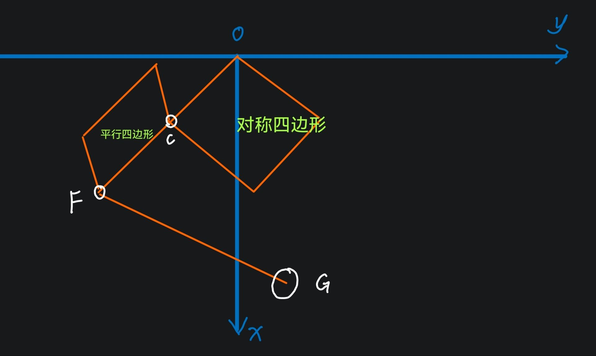

# Wheel_leg_V1 串联腿正运动学解算

## 1. 机构理解

根据当前结构描述和简化图，机构可以理解为一个平面轮腿机构：

1. 髋关节和膝关节的安装中心重合，记为固定点 `O`，并以 `O` 建立机构坐标系。
2. `OF` 是大腿等效杆，也就是 `joint1`。点 `F` 是大腿末端，点 `C` 是大腿中间的连接点。
3. `OC` 和 `CF` 位于同一直线上时，`C` 将大腿分成两段。根据补充尺寸，
   `OC = 116.40 mm`，`CF = 96.60 mm`，因此 `OF = 213.00 mm`。
4. 右侧闭环不是四边等长的菱形，而是风筝形对称四边形。若按图中顺序将其顶点记为 `O-A-D-C`，其对称轴为对角线 `OD`，则：
   `OA = OC = 116.40 mm`，`AD = DC = 135.00 mm`。
   左侧以 `C-F` 为一侧的是平行四边形。两部分通过刚性连接组合成串联五连杆传动机构。
5. `FG` 是小腿等效杆，也就是 `joint2` 的延长杆。点 `G` 是轮子的中心或轮端参考点，`FG = 250.00 mm`。
6. `joint6` 和 `joint5`、`joint9` 和 `joint8` 分别通过刚性连接形成固定夹角。该夹角均为 `alpha = 165.2 deg`，并且连接方向均朝向 `O` 一侧偏置。
7. `joint1` 由髋关节电机和膝关节电机协调驱动；在髋关节电机固定时，膝关节电机通过 `joint3` 及其后续闭环改变 `joint2` 的姿态。因此控制器最终需要得到的是等效关节 `joint1`、`joint2` 和轮端 `G` 的位姿。

简化图如下：



## 2. 坐标系和角度约定

本文严格采用简化图中的坐标方向：

- 原点：`O`，髋膝共点；
- `x` 轴：竖直向下为正；
- `y` 轴：图中水平向右为正，即车体前进方向；
- 所有位置单位：`mm`；
- 所有角度：内部计算使用 `rad`，文档中的结构角可以使用 `deg` 表示；
- 角度正方向：从 `+x` 轴转向 `+y` 轴。

注意：原始描述中曾写成“车身水平向前为 `x` 轴，向下为 `y` 轴”，这与图片中的坐标标注相反。本节以图片标注为准。若程序使用车体 `x` 向前、`z` 向上，则需要在接口层做坐标转换，不能直接复用下面的分量公式。

定义二维旋转矩阵和方向向量：

```text
R(theta) = [ cos(theta)  -sin(theta) ]
           [ sin(theta)   cos(theta) ]

e(theta) = [ cos(theta), sin(theta) ]^T
```

在这个约定下，长度为 `l`、方向角为 `theta` 的杆向量为：

```text
v(l, theta) = l * e(theta)
```

## 3. 关节点和杆长

| 符号 | 含义 | 长度 |
|---|---|---:|
| `O` | 髋膝共点固定基座 | `0` |
| `F` | `joint1` 末端 | `OF = 213.00` |
| `C` | `joint1` 中间连接点 | `OC = 116.40` |
| `G` | 轮端或轮心参考点 | `FG = 250.00` |
| `A`、`D` | 右侧对称四边形的另外两个顶点 | 由闭环求解 |
| `joint3` | `O-C` 侧杆 | `OC = 116.40` |
| `joint4`、`joint5` | 对称四边形另一组相邻杆，按图对应 `AD`、`DC` | `135.00` |
| `joint6`、`joint8` | 两个刚性偏置段 | `67.00` |
| `joint7` | `C` 到 `F` 的大腿分段 | `CF = 96.60` |
| `joint9` | 轮端侧刚性偏置后的末端段 | 与 `joint8` 固连 |

已知长度满足：

```text
OF = OC + CF
213.00 = 116.40 + 96.60
```

这是“`C` 位于 `OF` 上”的重要几何检查条件。这里的右侧对称四边形满足的是两组边长关系 `OA = OC`、`AD = DC`，并不是四条边全部相等，因此不能称为菱形。

若 CAD 中 `OF` 被明确标注为 `210.00 mm`，则必须重新确认 `OC` 或 `CF` 的尺寸：

```text
OF = 210.00 mm 且 OC = 116.40 mm  =>  CF = 93.60 mm
```

在 `CF = 96.60 mm` 保持不变的前提下，本文采用 `OF = 213.00 mm`。若 CAD 或实物中 `C` 不在 `OF` 的刚性延长线上，则上述等式和第 4 节的共线公式不能使用，应改为完整的五连杆闭环方程。

## 4. 大腿 `joint1` 的正运动学

设大腿 `OF` 的绝对姿态角为 `theta_1`，则：

```text
p_O = [0, 0]^T

p_C = OC * e(theta_1)
    = 116.40 * e(theta_1)

p_F = OF * e(theta_1)
    = 213.00 * e(theta_1)
```

也可以写成分量形式：

```text
x_C = 116.40 * cos(theta_1)
y_C = 116.40 * sin(theta_1)

x_F = 213.00 * cos(theta_1)
y_F = 213.00 * sin(theta_1)
```

并且有：

```text
p_F - p_C = CF * e(theta_1)
```

因此在这一解释下，`OC`、`CF` 和 `OF` 的方向相同，`C` 是大腿上的固定连接点，而不是一个可以独立改变方向的自由点。右侧四边形的几何约束则是 `OA = OC = 116.40 mm` 和 `AD = DC = 135.00 mm`。

### 电机角与 `theta_1`

若两台电机通过机构协调后共同改变大腿姿态，可将电机角到等效角写成：

```text
theta_1 = theta_1_0 + s_h * q_h + s_k * q_k
```

其中：

- `q_h`：髋关节电机角；
- `q_k`：膝关节电机角；
- `theta_1_0`：机械零位下的初始姿态角；
- `s_h`、`s_k`：由电机安装方向、减速器方向和连杆装配方向决定的 `+1` 或 `-1`。

如果实际控制定义是“两个电机各转 `30 deg` 时 `joint1` 也转 `30 deg`”，则应通过标定确认上式的系数，而不能默认直接将两个编码器角相加。

## 5. 五连杆闭环的解算方法

五连杆部分的作用是：已知输入电机角和点 `C`、`F` 的位置，求出内部点以及 `joint2` 的绝对姿态。最稳妥的实现方式是使用向量闭环，而不是根据图形名称直接假定某一根杆的角度。

对任意一个闭环，沿闭环正方向列向量和为零：

```text
sum(v_i) = 0
```

例如，若某一闭环由点 `P0 -> P1 -> P2 -> P3 -> P0` 构成，则：

```text
v(P0, P1) + v(P1, P2) + v(P2, P3) + v(P3, P0) = 0
```

展开后得到两个标量方程：

```text
sum(l_i * cos(theta_i)) = 0
sum(l_i * sin(theta_i)) = 0
```

未知量是内部杆的姿态角 `theta_i`。输入角确定后，可以使用以下两种方式求解：

1. **圆交点法**：已知两个端点和两根杆长时，将中间点求解为两个圆的交点。两个交点分别对应机构的两种装配分支，需要根据实际姿态固定选择“肘上”或“肘下”分支。
2. **数值迭代法**：以上一控制周期的内部角作为初值，使用 Newton-Raphson 或阻尼最小二乘求解闭环方程。该方法适合连续运动，但必须检查残差和雅可比矩阵是否退化。

每次求解都应检查：

```text
||closure_error|| < tolerance
```

同时检查杆长误差、关节限位和装配分支是否发生跳变。不要只检查最终的 `G` 点位置，因为内部闭环已经跳到另一分支时，末端轨迹可能仍然暂时连续。

## 6. 刚性偏置和轮端 `joint2`

设五连杆求得的 `joint8` 方向角为 `theta_8`。`joint9` 与 `joint8` 刚性连接，夹角为 `alpha = 165.2 deg`，则轮端延长方向可写为：

```text
theta_9 = theta_8 + s_alpha * alpha
```

其中 `s_alpha` 由图纸观察方向和左右腿镜像关系决定。对于另一侧镜像腿，通常不能直接复用同一个符号，应通过实物零位标定确认。

若 `joint9` 的末端为 `G`，则：

```text
p_G = p_F + FG * e(theta_9)
    = p_F + 250.00 * e(theta_9)
```

分量形式为：

```text
x_G = x_F + 250.00 * cos(theta_9)
y_G = y_F + 250.00 * sin(theta_9)
```

这里的 `p_F` 是大腿末端位置，`theta_9` 是由五连杆闭环和 `165.2 deg` 刚性偏置共同得到的轮端杆方向。因此 `joint2` 不能简单地等于 `theta_9 - theta_1`，除非两者的零位定义已经明确。

## 7. 最终正运动学输入和输出

建议将正运动学接口定义为：

```text
输入:
  q_h, q_k              # 两个电机编码器角
  theta_1_0             # joint1 机械零位
  装配分支选择           # elbow-up 或 elbow-down

输出:
  p_C, p_F, p_G         # C、F、G 在 O 坐标系中的位置
  theta_1               # 大腿绝对姿态角
  theta_2               # 小腿相对 joint1 的姿态角
  theta_9               # 轮端延长杆绝对姿态角
  closure_error         # 五连杆闭环误差
```

推荐计算顺序：

```text
1. 根据电机角得到 joint1 的 theta_1。
2. 根据 OF、OC、CF 求 p_C 和 p_F。
3. 使用五连杆闭环方程求内部点和 joint8 的姿态 theta_8。
4. 根据 alpha = 165.2 deg 求 theta_9。
5. 根据 p_G = p_F + FG * e(theta_9) 求轮端位置。
6. 计算 theta_2 = wrap_to_pi(theta_9 - theta_1) 或按控制器约定的相对角定义输出。
7. 检查闭环残差、杆长误差、关节限位和装配分支。
```

## 8. 目前需要确认的结构参数

为了把上述方程进一步化成唯一的闭式公式，还需要从 CAD 或实物确认以下内容：

1. `C` 是否始终是 `joint1` 上的刚性点，即运动过程中是否始终满足 `O-C-F` 共线。
2. `joint3 = OC` 是独立的电机输入杆，还是仅表示大腿中间的固定分段。
3. `joint4`、`joint5`、`joint6`、`joint7`、`joint8`、`joint9` 分别对应图中的哪一段杆，以及每个杆的起点和终点。
4. `A`、`D` 的准确位置，以及 `135.00 mm` 是否确实对应 `AD`、`DC` 两根杆。
5. `165.2 deg` 是有向夹角还是无向内角；左右腿镜像后符号是否改变。
6. `G` 是轮心、轮轴端点，还是轮子与地面的接触参考点。
7. 电机编码器零位、正方向、减速器传动比和左右腿镜像关系。

在这些信息确认之前，可以可靠使用第 4 节的大腿位置公式和第 6 节的刚性延长公式，但不应把五连杆内部点的编号关系写成唯一的闭式解。当前文档采用的是“`C` 为 `OF` 上固定中间点、右侧为 `OA = OC` 且 `AD = DC` 的对称四边形”的主解释。

---

## 附：URDF 坐标系与关节正方向约定（2026-09-11）

SolidWorks 原始导出的 base 坐标系为 `+X=左、+Y=车尾、+Z=上`（轮轴沿 X），
与训练代码"x 前进"的约定不一致。已用 `scripts/tools/prepare_wheel_leg_v1_urdf.py`
规范化并重导出 USD（坐标轴不对的 `urdf_V4.0_solidworks.urdf` 及旧 USD 已删除，
可从 git 历史 `21f2a31` 取回原始文件）：

- 新坐标系：`+X=前进、+Y=左、+Z=上`（L 腿 +Y，R 腿 -Y，轮轴沿 Y）。
- 关节正方向统一：两侧同号 = 镜像对称；`joint2` **减小 = 伸腿蹬地**（站高增大），
  增大 = 收腿；`joint1` 增大 = 轮端向前摆；`joint3` 正转 = 轮子向前滚。
- 零位（q=0）站高约 0.229 m（base 原点离地）；全关节空间 FK 搜索：轮子在髋正下方时
  最高可达约 0.52 m（需髋+膝配合），其中 0.25–0.39 m 为设计工作区间。

改完 URDF 后需重新转换 USD：`bash scripts/tools/convert_wheel_leg_urdf.sh`。
